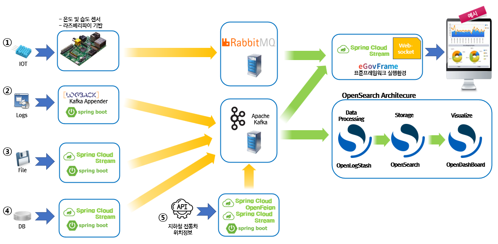

전자정부 표준프레임워크 실행환경 - 클라우드 데이터 스트림 예제

---

## 프로젝트 구조

```
egovframe-ex-cloud-data-stream/
├── DOCKER/                          # Docker Compose 기반 인프라
│   ├── apache-kafka/               # Apache Kafka (KRaft)
│   ├── kafbat-ui/                  # Kafka 모니터링 UI
│   ├── mongodb/                    # MongoDB Community
│   ├── opensearch/                 # OpenSearch
│   └── rabbitmq/                   # RabbitMQ
├── ex-egovframe-stream-pub-r2dbc/  # 스트림 프로듀서 (R2DBC)
├── ex-egovframe-stream-sub-mongodb/ # 스트림 컨슈머 (MongoDB)
└── IOT/                            # 온습도 센서 정보 전송 (Python)
```

---

## Data Stream 개요

### 정의

Spring Cloud Stream은 공유 메시징 시스템과 연결된 확장성이 뛰어난 이벤트 기반 마이크로서비스를 구축하기 위한 프레임워크이다.

**Spring Cloud Stream의 핵심 구성 요소:**
- **대상 바인더(Destination Binder)**: 외부 메시징 시스템과의 통합을 담당하는 구성 요소
- **대상 바인딩(Destination Binding)**: 외부 메시징 시스템과 애플리케이션 코드(생산자/소비자) 사이의 연결고리 제공
- **메시지(Message)**: 생산자와 소비자가 대상 바인더를 통해 통신하는 데 사용하는 표준 데이터 구조

Spring Integration의 메시징 처리 핵심 기능을 기반으로 사용하며, Spring Cloud Stream은 Spring Boot를 기반으로 Binder 연계를 제공하며 메시지 처리를 추상화하여 동일 환경의 분리된 애플리케이션 시스템 또는 다른 환경 간에도 연계 메시지 처리를 지원한다.

### 특징

**Data Stream**

비동기 데이터 처리는 지속적으로 발생하는 데이터를 실시간으로 처리하는 데 주요 목적이 있으며, 시간에 민감한 자료의 처리에 적합하고 다양한 지리적 위치에서 다양한 형식으로 전달할 수 있다.

**Data Stream vs Batch 비교**


| 구분 | 배치 처리 | 비동기 데이터 처리 |
|------|---------|----------------|
| **데이터 특성** | 한정된 대량의 데이터 | 지속적으로 데이터가 발생 |
| **처리 시점** | 스케줄링을 사용하여 특정 시간에 처리 | 데이터 발생 즉시 또는 일정한 간격 주기로 처리 가능 |
| **처리 방식** | 일괄로 정의된 유효단위 처리 | 데이터를 실시간으로 처리 |

### Data Stream 예제 5종

다양한 데이터 소스(IoT, 로그, 파일, DB, Open API)가 메시지 브로커(RabbitMQ, Apache Kafka)를 거쳐 Spring Cloud Stream·eGovFrame 실행환경 및 OpenSearch Architecture로 연동되는 서비스 메시 구성을 아래와 같이 정리할 수 있다.



**연계 유형 요약 (실시간)**

| 순번 | 유형 | 발행(Publisher) | Message Broker | 구독(Subscriber) | 비고 |
|:----:|:-----|:----------------|:---------------|:-----------------|:-----|
| 1 | IOT | 온습도 센서 | RabbitMQ | Websocket(Google Chart) | |
| 2 | Log | Logback Appender | Apache Kafka | OpenSearch | Logstash로 자료 처리 및 연동 |
| 3 | File | Line 기반 파일 | Apache Kafka | Websocket | |
| 4 | DB | H2 DB | Apache Kafka | Websocket(Google Chart) | |
| 5 | Open API | 지하철 전동차 정보 | Apache Kafka | MongoDB | 구독 데이터 저장 |

---

## 인프라 구성 정보

| 오픈소스 명 | 버전 | 라이선스 | 비고 |
|-----------|------|---------|------|
| **RabbitMQ** | 3.13.8 | MPL 2.0 | 3.13.7 이하 취약점 존재 |
| **OpenSearch** | 2.15.0 | Apache 2.0 | |
| **OpenSearch Dashboard** | 2.15.0 | Apache 2.0 | |
| **OpenSearch Logstash** | 2.15.0 | Apache 2.0 | |
| **Apache Kafka** | 4.0.1 | Apache 2.0 | KRaft 모드 (Zookeeper 미사용) |
| **Kafbat UI** | 1.4.2 | Apache 2.0 | ghcr.io/kafbat/kafka-ui |
| **MongoDB Community** | 8.0.18 | SSPL v1.0 | |

### 라이선스 주의사항
상용 제품으로 패키징하여 배포 또는 서비스 하는경우 다음을 주의한다.
#### MPL (Mozilla Public License) 2.0
- 사내에서만 사용(배포 없음) 하는 경우엔 추가 의무가 거의 없다
- 수정해서 배포(또는 실행 파일 형태로 외부 제공)하면, 수정된 MPL 적용 파일의 소스 제공 의무가 생길 수 있다
- 참고: https://www.mozilla.org/en-US/MPL/2.0/FAQ

#### SSPL (Server Side Public License) v1.0
- 프로그램(또는 수정본)의 기능을 제3자에게 '서비스로 제공'하면, 소스 공개 의무가 폭넓게 발생할 수 있으므로 주의가 필요하다
- 버전에 v가 공식적으로 붙어 있으며, 오픈소스 정의를 관리하는 기관인 OSI(Open Source Initiative)는 아직 SSPL을 오픈소스 라이선스로 승인하지 않았다

### 네트워크 구성
- **kafka-network**: Kafka ↔ Kafbat UI
- **egov-network**: OpenSearch, RabbitMQ, MongoDB 공통 인프라

### 네트워크 설정 안내

**⚠️ 중요**: 현재 IP는 `192.168.100.60`으로 설정되어 있으며, 테스트 장비의 IP에 맞도록 수정하여 사용하세요.

IP 설정이 필요한 파일:
- `DOCKER/apache-kafka/docker-compose.yml` - KAFKA_ADVERTISED_LISTENERS
- `ex-egovframe-stream-pub-r2dbc/src/main/resources/application.yml` - brokers, rabbitmq.host
- `ex-egovframe-stream-sub-mongodb/src/main/resources/application.yml` - brokers, rabbitmq.host, websocket.host

---

## Docker 인프라 기동

### 1. 네트워크 생성 서비스 먼저 기동

```bash
# Kafka 네트워크 생성
cd DOCKER/apache-kafka
docker compose up -d

# Egov 네트워크 생성
cd DOCKER/opensearch
docker compose up -d
```

### 2. 외부 네트워크 사용 서비스 기동

```bash
# Kafka UI (kafka-network 사용)
cd DOCKER/kafbat-ui
docker compose up -d

# RabbitMQ (egov-network 사용)
cd DOCKER/rabbitmq
docker compose up -d

# MongoDB (egov-network 사용)
cd DOCKER/mongodb
docker compose up -d
```

### 3. 서비스 접속 정보

| 서비스 | 포트 | 접속 URL | 비고 |
|--------|------|----------|------|
| Kafka | 9092 | `192.168.100.60:9092` | 브로커 접속 |
| Kafbat UI | 9980 | http://localhost:9980 | Kafka 모니터링 |
| RabbitMQ | 5672, 15672 | http://localhost:15672 | Management UI |
| MongoDB | 27017 | `192.168.100.60:27017` | root/frame001 |
| OpenSearch | 9200 | https://localhost:9200 | admin/Egov2015! |
| OpenSearch Dashboards | 5601 | http://localhost:5601 | 대시보드 |
| Logstash | 5001 | - | 파이프라인 입력 |

**※ 주의**: 기본 설정 비번은 반드시 변경한 후 사용한다.

---

## 주요 설정 변경 사항

### 1. Apache Kafka (KRaft 모드)

**변경 내용:**
- Zookeeper 제거, KRaft 전용 모드로 설정
- 호스트 접속을 위해 `ADVERTISED_LISTENERS` IP 지정

```yaml
KAFKA_ADVERTISED_LISTENERS: PLAINTEXT://kafka:29092,PLAINTEXT_HOST://192.168.100.60:9092
```

**주의사항:**
- 호스트 IP가 변경되면 위 설정을 수정해야 함
- 컨테이너 재시작 필요: `docker compose down && docker compose up -d`

### 2. OpenSearch 보안 설정

**초기 Admin 비밀번호:**
```yaml
OPENSEARCH_INITIAL_ADMIN_PASSWORD: Egov2015!
```

OpenSearch 2.12+ 버전부터 보안 플러그인 초기화 시 필수 설정

### 3. 네트워크 구조 통일

**변경 전 (deprecated):**
```yaml
networks:
  default:
    external:
      name: egov-network
```

**변경 후:**
```yaml
services:
  service-name:
    networks:
      - egov-network

networks:
  egov-network:
    name: egov-network
    external: true
```

### 4. Spring Cloud Function Definition 속성 경로 (Spring Cloud Stream 4.x)

**변경 전 (Spring Cloud Stream 3.x에서 허용):**
```yaml
spring:
  cloud:
    stream:
      function:
        definition: basicProducer   # spring.cloud.stream.function.definition
```

**변경 후 (Spring Cloud Stream 4.x에서 필수):**
```yaml
spring:
  cloud:
    function:
      definition: basicProducer     # spring.cloud.function.definition
    stream:
      # ...
```

- `spring.cloud.function.definition`은 Spring Cloud Function 프로젝트 소속 속성
- Spring Cloud Stream 3.x에서는 `spring.cloud.stream.function.definition`도 내부적으로 인식했으나, 4.x에서는 인식하지 않음
- YAML 들여쓰기 한 레벨 차이(`stream` 하위 vs `cloud` 하위)로 완전히 다른 속성 경로가 되므로 주의
- 설정이 잘못되면 `Multiple functional beans were found... can't determine default function definition` 경고 발생 후 Supplier/Consumer가 바인딩되지 않음

### 5. Docker Compose version 필드 제거

Docker Compose V2에서는 `version` 필드가 더 이상 필요하지 않으므로 모든 compose 파일에서 제거

---

## 애플리케이션 설정

### Spring Cloud Stream Kafka 설정

**공통 설정 (`application.yml`):**

```yaml
spring:
  cloud:
    stream:
      kafka:
        binder:
          autoCreateTopics: false
          autoAddPartitions: false
          brokers: 192.168.100.60
          # Kafka 클라이언트 텔레메트리 비활성화 (브로커에 메트릭 전송 안 함)
          configuration:
            enable.metrics.push: false
```

**주요 포인트:**
- `zkNodes` 제거: Kafka 4.x KRaft 모드에서는 Zookeeper 미사용
- `enable.metrics.push: false`: 텔레메트리 API 불일치 경고 방지
- `brokers`: 호스트 IP 지정 (포트 생략 시 기본 9092)

---

## 버전 호환성

### Kafka 클라이언트 ↔ 브로커

- **클라이언트**: apache-kafka-java 3.9.1 (Spring Cloud Stream이 가져옴)
- **브로커**: Apache Kafka 4.0.1
- **호환성**: ✅ 정상 동작 (Kafka는 하위 호환성 우수)
- **텔레메트리 경고**: `enable.metrics.push: false`로 해결

### OpenSearch ↔ Logstash

- **OpenSearch**: 2.15.0
- **Logstash**: 7.16.2 (logstash-output-opensearch 플러그인 2.0+)
- **호환성**: ✅ 플러그인 2.0+가 OpenSearch 2.x 지원

---

## 트러블슈팅

### 1. Kafka 연결 실패: `UnknownHostException: kafka`

**원인:** 호스트(Docker 밖)에서 앱 실행 시 `kafka` 호스트명 해석 불가

**해결:**
- `KAFKA_ADVERTISED_LISTENERS`를 실제 IP로 설정 (위 Kafka 설정 참고)
- `application.yml`의 `brokers`를 실제 IP로 지정

### 2. OpenSearch 컨테이너 재시작 반복

**원인:** `OPENSEARCH_INITIAL_ADMIN_PASSWORD` 미설정

**해결:**
```yaml
environment:
  - OPENSEARCH_INITIAL_ADMIN_PASSWORD=Egov2015!
```

---

## 개발 환경

### 필수 요구사항
- 표준프레임워크 v5.0.0
- Spring Cloud Stream v4.3.0
- Docker Desktop 4.37.1+ (운영 기반으로 대체 가능)
- Java 17+
- Maven 3.9+
- Python 3.9.2+
- Raspberry Pi 1 Model B 이후 출시모델 (512MB RAM) + IOT(온습도센서)

### 테스트 환경
- macOS / Linux
- 최소 8GB RAM (Docker에 4GB 이상 할당)
- 여유 디스크 공간 20GB+

---

## 위키 가이드 문서
- [Cloud Data Stream 환경설정](https://www.egovframe.go.kr/wiki/doku.php?id=egovframework:rte2:rex:clouddatastream)
- [Data Stream Publish 예제](https://www.egovframe.go.kr/wiki/doku.php?id=egovframework:rte4:rex:publish_data_stream)
- [Data Stream Subscribe 예제](https://www.egovframe.go.kr/wiki/doku.php?id=egovframework:rte4:rex:subscribe_data_stream)

## 참고 문서

### 오픈소스 공식 문서
- [Apache Kafka 4.0 Documentation](https://kafka.apache.org/40/documentation.html)
- [Spring Cloud Stream Kafka Binder](https://spring.io/projects/spring-cloud-stream)
- [OpenSearch Documentation](https://opensearch.org/docs/latest/)
- [Kafbat UI Documentation](https://ui.docs.kafbat.io/)
- [MongoDB Documentation](https://www.mongodb.com/docs/manual/)

